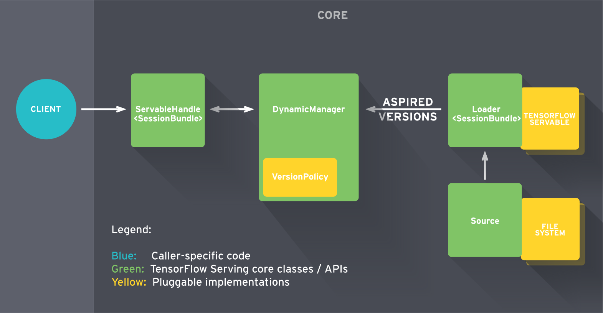

# Tensorflow

## Overview
TensorFlow Serving is a **flexible, high-performance serving system for machine learning models**, designed for production environments. TensorFlow Serving makes it easy to deploy new algorithms and experiments, while keeping the same server architecture and APIs. TensorFlow Serving provides out of the box integration with TensorFlow models, but can be easily extended to serve other types of models.

## System Architecture

### TensorFlow Servables
These are the central rudimentary units in TensorFlow Serving. TensorFlow Servables are the objects that clients use to perform the computation.
The size of a servable is flexible. A single servable might include anything from a lookup table to a single model to a tuple of inference models. Servables can be of any type and interface, enabling flexibility and future improvements such as:
* Streaming results
* Experimental APIs
* Asynchronous modes of operation.

### Servable Versions
TensorFlow Serving can handle one or more versions of a servable, over the lifetime of a single server instance. This opens the door for fresh algorithm configurations, weights, and other data to be loaded over time. They also enable more than one version of a servable to be loaded concurrently, supporting gradual roll-out and experimentation. At serving time, clients may request either the latest version or a specific version id, for a particular model.

### Servable Streams
A sequence of versions of a servable sorted by increasing version numbers.

## TensorFlow API
### TensorFlow Models
A Serving represents a model as one or more servables. A machine-learned model may include one or more algorithms (including learned weights) and lookup or embedding tables. A servable can also serve as a fraction of a model, for example, a large lookup table can be served as many instances.

### TensorFlow Loaders
Loaders manage a servable’s life cycle. The Loader API enables common infrastructure independent from specific learning algorithms, data or product use-cases involved. Specifically, Loaders standardize the APIs for loading and unloading a servable.

### Sources in TensorFlow Architecture
Sources are in simple terms, modules that find and provide servables. Each Source provides zero or more servable streams. For each servable stream, a Source supplies one Loader instance for each version it makes available to be loaded.
TensorFlow Managers
Tensorflow Managers handle the full lifecycle of Servables, including:
* Loading Servables
* Serving Servables
* Unloading Servables

Managers listen to sources and track all versions. The Manager tries to fulfil Sources’ requests but, may refuse to load an aspired version. Managers may also postpone an “unload”. For example, a Manager may wait to unload until a newer version finishes loading, based on a policy to guarantee that at least one version is loaded at all times. For example, GetServableHandle(), for clients to access loaded servable instances.
### TensorFlow Core
This manages (via standard TensorFlow Serving APIs) the following aspects of servables:

### TensorFlow Architecture: TensorFlow Core

* Lifecycle
* Metrics
* TensorFlow Serving Core treats servables and loaders as opaque objects.

### Tensorflow Technical Architecture
* Sources create Loaders for Servable Versions, then Loaders are sent as Aspired Versions to the Manager, which loads and serves them to client requests.
* The Loader contains whatever metadata it needs to load the Servable.
* The Source uses a callback to notify the manager of the Aspired Version.
* The manager applies the configured Version Policy to determine the next action to take.
* If the manager determines that it’s safe, it gives the Loader the required resources and tells the Loader to load the new version.
* Clients ask the manager for the Servable, either specifying a version explicitly or just requesting the latest version. The manager returns a handle for the Servable. The Dynamic Manager applies the Version Policy and decides to load the new version.
* The Dynamic Manager tells the Loader that there is enough memory. The Loader instantiates the TensorFlow graph with the new weights.
* A client requests a handle to the latest version of the model, and the Dynamic Manager returns a handle to the new version of the Servable.

### TensorFlow Loaders
These Loaders are the extension point for adding algorithm and data backends. TensorFlow is one such algorithm backend. For example, you would implement a new Loader in order to load, provide access to, and unload an instance of a new type of servable machine learning model.

### Batcher in TensorFlow Architecture
Batching of multiple requests into a single request can significantly reduce the cost of performing inference, especially in the presence of hardware accelerators such as GPUs. TensorFlow Serving includes a request batching widget that let clients easily batch their type-specific inferences across requests into batch requests that algorithm systems can more efficiently process.